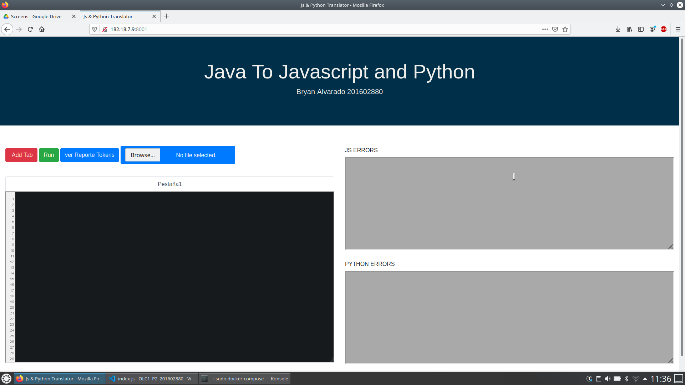
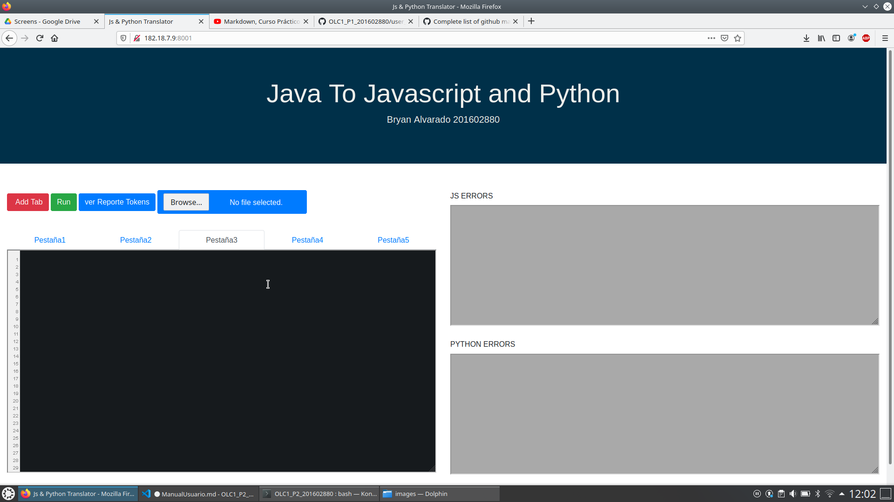
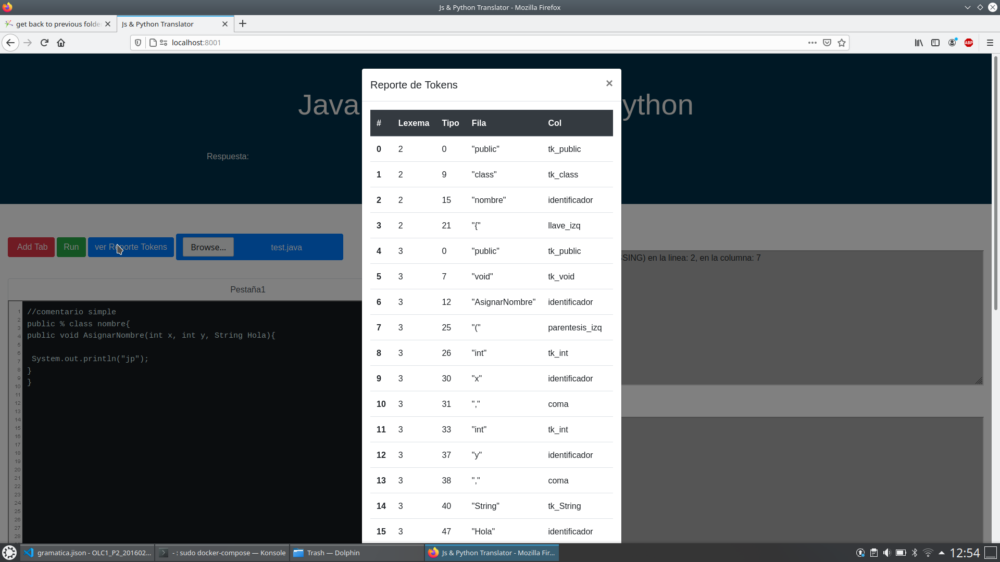
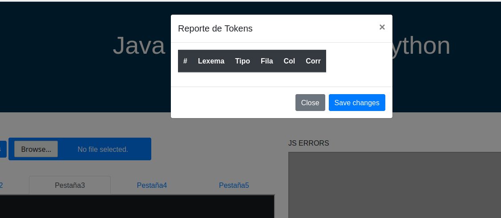
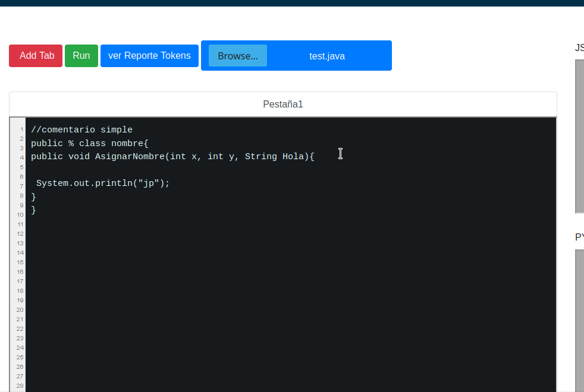
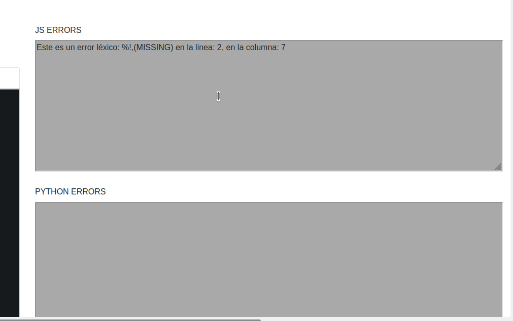

# Proyecto 2 Compiladores 1 
## Traductor de Lenguaje Java :tea: a Javascript & Python :snake:


"El presente documento fue elaborado, con el objetivo de la comprension al usuario final, el funcionamiento de la aplicacion, conteniendo asi la implementacion de graficos, imagenes y textos instructivos".

***Autor: @Alex4191***

----

#### Funciones Principales
   - Analisis Lexico - (Analizador de Javascript )
   - Analisis Sintactico - (Analizador de Javscript)
   - Traducion de Codigo Java-Python
   - Analisis Lexico-Sintactico (Mediante la Herramienta JISON)
   - Traduccion de Codigo Java-Javascript


----
### Flujo esperado de la aplicacion :exclamation: :exclamation: :exclamation:

```
 El usuario ingresa a la aplicacion mediante la direccion:


 http://182.18.7.9:8001/ o puede acceder mediante http://localhost:8001/

 Al desplegar la aplicacion el usuario selecciona la opcion de Browse y selecciona el archivo .java que desee, la aplicacion mostrara el contenido del archivo en el textArea de color negro. El usuario seleccciona la opcion Run y la aplicacion comienza el analisis del Lexico y sintactico del archivo, al finalizar el analisis , el usuario puede visualizar el grafo del arbol, los tokens mediante la opcion de ver tokens y ademas en caso de que el analizador encontrar errores, podra verlos en las consolas de color gris, que se encuentran del lado derecho.

 >>> la funcionalidad a detalle de las opciones y componentes se detallan a lo largo del documento.


````


## Vista General de la aplicacion :


### Componentes principales
   * Add Tab
   * Run
   * ver Reporte Tokens
   * Browse
   * Text Area ( negra)
   * Js Errors ( text Area gris 1)
   * Python Errors (text Area gris 2)

<br>

---
### Funcionalidad de los componentes


1. AddTab: <br> La opcion addTab permite al usuario generar una cantidad "N" de tabs o areas de trabajo u pestanas.




2.Run: <br> Permite realizar iniciar el proceso de traduccion del la Tab actual. ( NOTA: el analizador obtendra la data actual en la  area de trabajo que se encuentre en ese momento.)


3.Ver reporte Tokens: <br> Esta opcion despliega un listado de tokens que se recolectaron durante el proceso de traduccion.
`
<br>***Cabe recalcar que en caso no haya realizado traduccion no podra visualizar esta opcion***.


<br>

4.Browse: <br> esta opcion permite al usuario cargar mediante un selector de archivos, el documento que se utilizara par analizar y este sera desplegado en el actual tab.

<br>

5.TextArea(black): <br>
este es el area principal de analisis, donde se podra vizualizar el texto que se procedera a analizar.



6. Js Errors ( text Area gris 1) & Python Errors (text Area gris 2)

estas areas de texto se podran visualizar aquellos errores que se recolectaron durante el proceso de analisis y traduccion.



   